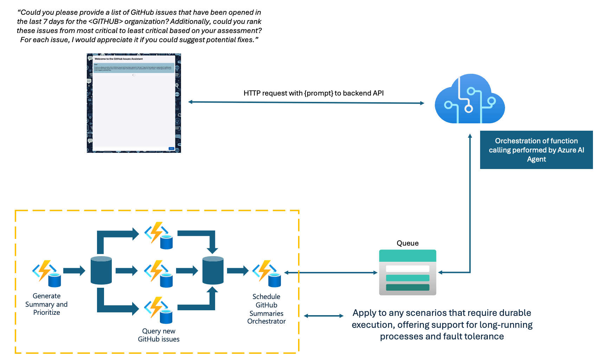

<!--
---
name: Azure Function using Azure AI agent service with Durable Functions to process GitHub issues
description: Azure Function using Azure AI agent service with Durable Functions to process GitHub issues in a scalable, reliable way
page_type: sample
products:
- azure-functions
- azure
- entra-id
- azure-openai
- durable-task-scheduler
urlFragment: azure-functions-ai-services-agent-durable-python
languages:
- python
- bicep
- azdeveloper
---
-->

# Using Azure Functions with Durable Functions to enable function calling from Azure AI Agent service

This sample demonstrates how to use [Azure AI Agent service](https://learn.microsoft.com/en-us/azure/ai-studio/how-to/develop/sdk-overview?tabs=sync&pivots=programming-language-python#azure-ai-agent-service) function calling with [Azure Durable Functions](https://learn.microsoft.com/en-us/azure/azure-functions/durable/durable-functions-overview?tabs=python) to process complex workflows. The sample shows a pattern where:

1. Function calls are placed on a storage queue by the Agent service
2. An Azure Function listens to that queue and triggers a durable orchestration
3. The orchestration manages a reliable workflow to process GitHub issues

## Architecture


The key advantage of using Durable Functions is the ability to handle complex, long-running processes with built-in state management, automatic retries, and the fan-out/fan-in pattern.

You can learn more about Azure Functions in the [Official documentation](https://learn.microsoft.com/en-us/azure/azure-functions) and about Durable Functions in the [Durable Functions documentation](https://learn.microsoft.com/en-us/azure/azure-functions/durable/durable-functions-overview?tabs=python).

The [`app`](./app/) folder contains the function code used in this sample while the infra folder contains all of the Azure resources that need to be created.

## Prerequisites

* [Azure Functions Core Tools v4.x](https://learn.microsoft.com/azure/azure-functions/functions-run-local?tabs=v4%2Cwindows%2Cnode%2Cportal%2Cbash)
* [Azure AI Agent Service](https://learn.microsoft.com/en-us/azure/ai-studio/how-to/develop/sdk-overview?tabs=sync&pivots=programming-language-python#azure-ai-agent-service)
* [Azurite](https://github.com/Azure/Azurite) for local storage emulation
* [GitHub Personal Access Token](https://docs.github.com/en/authentication/keeping-your-account-and-data-secure/managing-your-personal-access-tokens) (for accessing GitHub repositories)

## Prepare your local environment

### Create Azure resources for local and cloud dev-test

Once you have your Azure subscription, run the following in a new terminal window to create Azure OpenAI and other resources needed:

```bash
azd init --template https://github.com/Azure-Samples/azure-functions-ai-services-agent-durable-python
```
Mac/Linux:
```bash
chmod +x ./infra/scripts/*.sh 
```
Windows:
```Powershell
set-executionpolicy remotesigned
```
Run the follow command to provision resources in Azure
```bash
azd provision
```

### Create local.settings.json (Should be in the same folder as host.json. Automatically created if you ran azd provision)
```json
{
  "IsEncrypted": false,
  "Values": {
    "FUNCTIONS_WORKER_RUNTIME": "python",
    "STORAGE_CONNECTION__queueServiceUri": "https://<storageaccount>.queue.core.windows.net",
    "PROJECT_CONNECTION_STRING": "<project connnection for AI Project>",
    "AzureWebJobsStorage": "UseDevelopmentStorage=true",
    "DTS_CONNECTION_STRING": "<durable task scheduler connection string>",
    "TASKHUB_NAME": "<taskhub name>",
    "GITHUB_ACCESS_TOKEN": "<github access token>",
    "AZURE_OPENAI_ENDPOINT": "<openai endpoint>",
    "CHAT_MODEL_DEPLOYMENT_NAME": "chat"
  }
}
```

## Understanding the Durable Functions Implementation

This sample demonstrates several key Durable Functions patterns:

### 1. Function Chaining

The orchestrator function (`SummarizeGitHubIssues`) chains together multiple activity functions:
- `QueryRepos` to get GitHub repositories
- `AskAOAI` to convert time formats and extract organization names
- `QueryNewIssues` to get issues for each repository
- `SummarizeIssues` to generate summaries using Azure OpenAI

### 2. Fan-out/Fan-in Pattern

The orchestrator implements the fan-out/fan-in pattern by:
1. Getting a list of repositories
2. Creating parallel tasks to query issues for each repository (`fan-out`)
3. Waiting for all tasks to complete and aggregating results (`fan-in`)
4. Processing the combined data

```python
# Fan-out: Create a list of tasks to get issues for each repository
tasks = []
for repo_name in repo_names:
    task = context.call_activity_with_retry("QueryNewIssues", retry_options, {'repoName': repo_name, ...})
    tasks.append(task)

# Fan-in: Wait for all tasks to complete and aggregate the results
all_issues = yield context.task_all(tasks)
```

### 3. Reliability with Retry Options

The sample uses Durable Functions' built-in retry mechanism to handle transient failures in activity functions:

```python
first_retry_interval_in_milliseconds = 5000
max_number_of_attempts = 3
retry_options = df.RetryOptions(first_retry_interval_in_milliseconds, max_number_of_attempts)

# Call activity with retry
result = yield context.call_activity_with_retry("ActivityName", retry_options, input)
```

### 4. Queue Integration

The process begins with a queue trigger that starts the durable orchestration:

```python
@app.function_name(name="GitHubIssuesSummaries")
@app.durable_client_input(client_name="client")
@app.queue_trigger(arg_name="msg", queue_name="input", connection="STORAGE_CONNECTION")  
async def process_queue_message(msg: func.QueueMessage, client) -> None:
    # Start orchestration
    instance_id = await client.start_new("SummarizeGitHubIssues", None, messagepayload)
```

## Architecture Overview

1. **HTTP Endpoint**: Provides a REST API for the React frontend
2. **Agent Service Integration**: Creates and manages AI agents that can call functions
3. **Queue Trigger**: Receives function calls from the Agent service
4. **Durable Orchestrator**: Manages the workflow to process GitHub issues
5. **Activity Functions**: Perform individual tasks like querying repos and summarizing issues
6. **Output Queue**: Returns results back to the Agent service

## Run your app using Visual Studio Code

1. Open the folder in a new terminal.
1. Run the `code .` code command to open the project in Visual Studio Code.
1. In the command palette (F1), type `Azurite: Start`, which enables debugging with local storage for Azure Functions runtime.
1. Press **Run/Debug (F5)** to run in the debugger. Select **Debug anyway** if prompted about local emulator not running.
1. Send POST requests to the `prompt` endpoint using your HTTP test tool. If you have the [RestClient](https://marketplace.visualstudio.com/items?itemName=humao.rest-client) extension installed, you can execute requests directly from the [`test.http`](./app/test.http) project file.

## Deploy to Azure

Run this command to provision the function app, with any required Azure resources, and deploy your code:

```shell
azd up
```

You're prompted to supply these required deployment parameters:

| Parameter | Description |
| ---- | ---- |
| _Environment name_ | An environment that's used to maintain a unique deployment context for your app. You won't be prompted if you created the local project using `azd init`.|
| _Azure subscription_ | Subscription in which your resources are created.|
| _Azure location_ | Azure region in which to create the resource group that contains the new Azure resources. Only regions that currently support the Flex Consumption plan are shown.|

After publish completes successfully, `azd` provides you with the URL endpoints of your new functions.

## Testing the deployed application

1. The application includes a React frontend that can be accessed through the deployed Static Web App URL.
2. The frontend communicates with the Azure Function API endpoint to process requests.
3. You can test the GitHub issue summarization by entering prompts like "Summarize GitHub issues for Microsoft/vscode from last week" in the chat interface.

## Redeploy your code

You can run the `azd up` command as many times as you need to both provision your Azure resources and deploy code updates to your function app.

>[!NOTE]
>Deployed code files are always overwritten by the latest deployment package.

## Clean up resources

When you're done working with your function app and related resources, you can use this command to delete the function app and its related resources from Azure and avoid incurring any further costs (--purge does not leave a soft delete of AI resource and recovers your quota):

```shell
azd down --purge
```
`